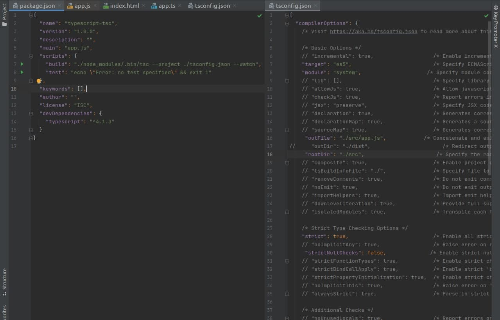
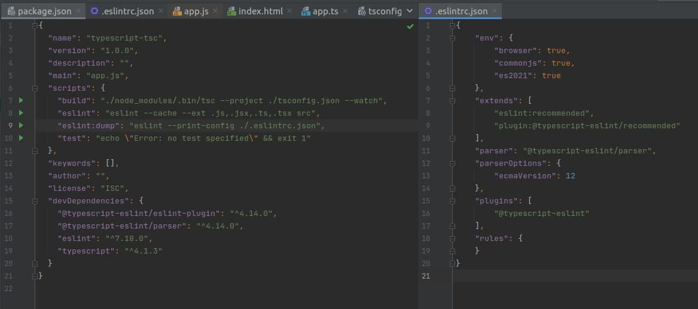
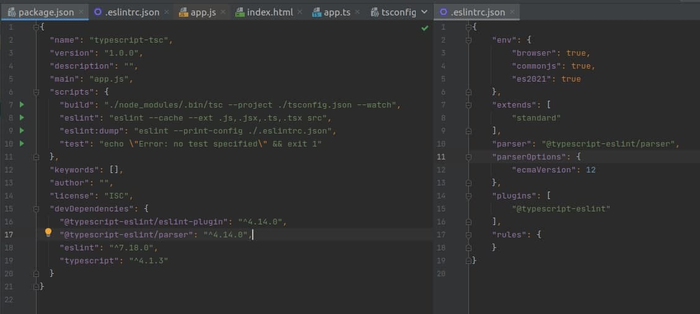

# Домашнее задание к занятию «1.1  Начало работы с TypeScript, ESLint»

### Подготовьте рабочую среду для дальнейшей работы.

#### 1. Установите TypeScript. Настройте dev-сборку .ts-файлов, как на лекции.
 

Что вы должны увидеть после выполнения шага:

  

#### 2. Добавьте в проект пакеты ESLint. Создайте файл конфигурации ESLint.

Что вы должны увидеть после выполнения шага:

#### 3. Установите любой набор правил для ESLint.

Что вы должны увидеть после выполнения шага:

Это самостоятельное домашнее задание, его выполнение пригодится на следующих занятиях.
