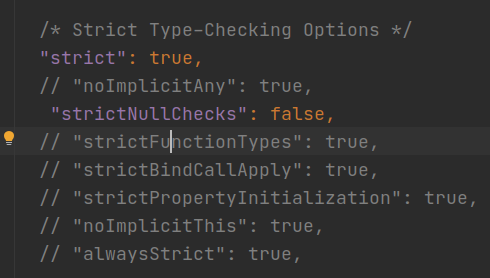

# Домашнее задание к занятию «1.2. Система типов TypeScript. Принципы ООП. SOLID»

**Правила выполнения домашней работы.** 
* Выполняйте домашнее задание в отдельной ветке проекта на GitHub.
* В поле для сдачи работы прикрепите ссылку на ваш проект в Git.
* На проверку можно отправить как все задачи вместе, так и каждую задачу по отдельности. 
* Во время проверки вашей домашней работы по частям будет стоять статус «На доработке».
* Любые вопросы по решению задач можете задавать в чате учебной группы.

### Подготовьте рабочую среду для дальнейшей работы.

#### 1. Напишите интерфейс к сущности «книга» к разрабатываемому приложению «библиотека» из модуля NDSE «Настройка окружения и Express.js». На протяжении нескольких занятий мы будем поэтапно переписывать наш проект на TypeScript. Целью этого задания является только создание интерфейса без переписывания логики существующего приложения. 

#### 2. Включите строгий режим strict в опциях компилятора, а параметр strictNullChecks выключите.

Что вы должны увидеть после выполнения шага:

#### 3. Напишите астрактный class BooksRepository к разрабатываемому приложению «библиотека» первого модуля. Сейчас мы его не будем применять, сейчас мы только напишем свой первый астрактный класс

Методы, которые должны быть в BooksRepository:

1. createBook(book){} — создание книги.
2. getBook(id){} — получение книги по id.
3. getBooks(){} — получение всех книг.
4. updateBook(id){} — обновление книги.
5. deleteBook(id){} — удаление книги.

